Data Professionals Salary in India - 2022
================
Darwin Herrera C.
7/2/2022

``` r
df <- read.csv('Salary Dataset.csv')
```

# Parameters

This data was extracted from the Internet on February 7, 2022.

``` r
exchange_rate_usd_inr <- 0.0134 # https://www.google.com/finance/quote/INR-USD
exchange_rate_eur_inr <- 0.0117 # https://www.google.com/finance/quote/INR-EUR
exchange_rate_afn_inr <- 1.2742 # https://www.google.com/finance/quote/INR-AFN
minimum_wages_per_day_inr <- 178 # https://tradingeconomics.com/india/minimum-wages
```

# Cleaning data

Cleaning the data and creating columns that expand the useful
information

``` r
df$salary_currency <- substr(df$Salary, 1, 1)
df$salary_currency <- ifelse(startsWith(df$Salary, "AFN"), "AFN", df$salary_currency)

df$payment_per <- substr(df$Salary, nchar(df$Salary)-1, nchar(df$Salary))
df$salary <- as.numeric(str_remove_all(substr(df$Salary, 2, nchar(df$Salary)-3), ","))
df$salary <- ifelse(df$salary_currency == "AFN", as.numeric(str_remove_all(substr(df$Salary, 4, nchar(df$Salary)-3), ",")), df$salary)

df$estimated_monthly_salary_inr <- ifelse(df$payment_per == "yr", as.numeric(df$salary)/12, 
                                   ifelse(df$payment_per == 'hr', as.numeric(df$salary)*8*5*4, as.numeric(df$salary)))
df$estimated_monthly_salary_inr <- ifelse(df$salary_currency == "$", df$estimated_monthly_salary_inr/exchange_rate_usd_inr,
                                   ifelse(df$salary_currency == "£", df$estimated_monthly_salary_inr/exchange_rate_eur_inr,
                                   ifelse(df$salary_currency == "AFN", df$estimated_monthly_salary_inr/exchange_rate_afn_inr, df$estimated_monthly_salary_inr)))
df$estimated_monthly_salary_usd <- df$estimated_monthly_salary_inr*exchange_rate_usd_inr
```

# Description of the observations in the data

``` r
knitr::kable(t(introduce(df)))
```

|                      |        |
|:---------------------|-------:|
| rows                 |   4344 |
| columns              |     10 |
| discrete_columns     |      6 |
| continuous_columns   |      4 |
| all_missing_columns  |      0 |
| total_missing_values |      2 |
| complete_rows        |   4342 |
| total_observations   |  43440 |
| memory_usage         | 707824 |

``` r
plot_intro(df)
```

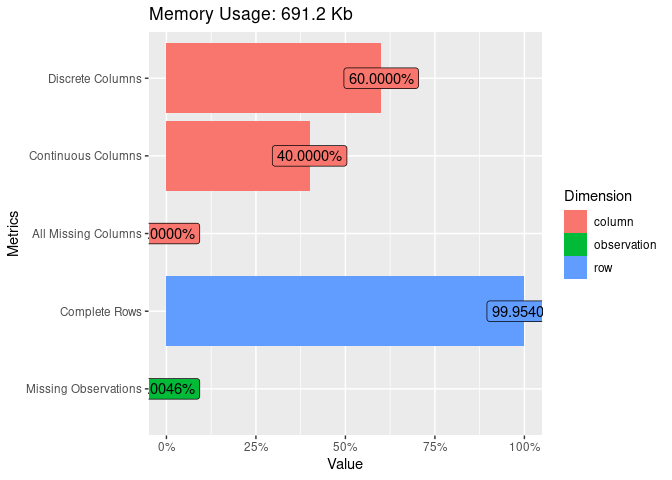<!-- -->

The data looks good, since it does not need so much data, however, it
gives us quite complex information, such as the job title and salary,
which we must analyze and separate later.

``` r
plot_bar(df[,c("Job.Title", "Location")], ncol = 1)
```

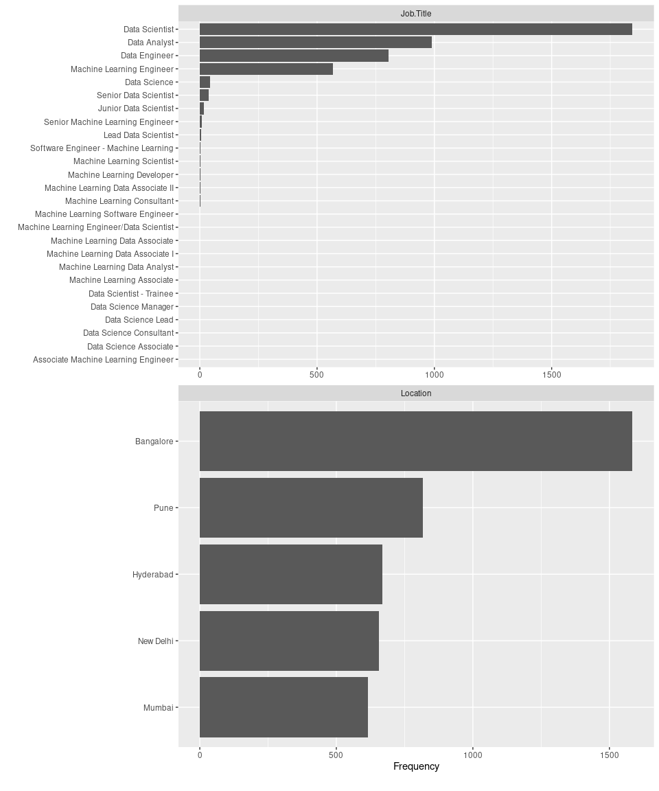<!-- -->

# Estimated salaries per month in USD

We cut the data a little bit, only for visualization purposes.

``` r
ggplot(df, aes(x=estimated_monthly_salary_usd)) + 
  xlab("USD") + ylab("Frequency") + geom_histogram(binwidth=100, fill='darkblue', alpha = 0.8) +  
  xlim(0, 10000) + 
  ggtitle("Estimated salaries of data professionals per month") 
```

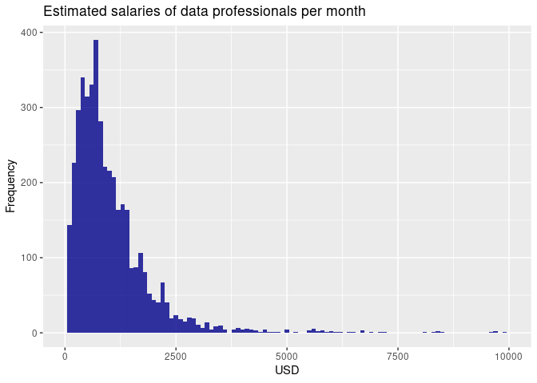<!-- -->

We found a lot of atypical data, after 10000 USD, not shown in the
previous visualization, so they are detailed below

|      | Company.Name                   | Salary        | Job.Title      | estimated_monthly_salary_usd |
|:-----|:-------------------------------|:--------------|:---------------|-----------------------------:|
| 416  | ICICI Bank                     | $2,24,948/yr  | Data Scientist |                     18745.67 |
| 420  | Hashworks                      | ₹13,43,505/mo | Data Scientist |                     18002.97 |
| 575  | Société Générale               | ₹95,68,943/yr | Data Scientist |                     10685.32 |
| 586  | MiQ                            | £16,74,802/yr | Data Scientist |                    159845.77 |
| 659  | Infosys                        | $5,11,613/yr  | Data Scientist |                     42634.42 |
| 901  | L Brands                       | ₹15,67,329/mo | Data Scientist |                     21002.21 |
| 1055 | Tata Consultancy Services      | £7,03,427/yr  | Data Scientist |                     67136.20 |
| 1071 | WNS                            | £2,05,049/yr  | Data Scientist |                     19570.20 |
| 1116 | Saama Technologies             | £9,34,857/yr  | Data Scientist |                     89224.24 |
| 1847 | IBM                            | $2,05,476/yr  | Data Scientist |                     17123.00 |
| 1860 | Google                         | $1,24,434/yr  | Data Scientist |                     10369.50 |
| 1866 | DONE by NONE                   | $50,367/mo    | Data Scientist |                     50367.00 |
| 1870 | Bharti Airtel                  | $6,04,401/yr  | Data Scientist |                     50366.75 |
| 2487 | Genpact                        | $5,13,690/yr  | Data Analyst   |                     42807.50 |
| 3286 | Datametica                     | £10,15,458/yr | Data Engineer  |                     96916.93 |
| 3408 | Cognizant Technology Solutions | £1,00,000/mo  | Data Engineer  |                    114529.91 |
| 3420 | Cognizant Technology Solutions | $8,20,000/yr  | Data Engineer  |                     68333.33 |
| 3443 | ServiceNow                     | $37,083/mo    | Data Engineer  |                     37083.00 |

# Location analysis

``` r
p1 <- ggplot(df, aes(x=estimated_monthly_salary_inr*exchange_rate_usd_inr,y=Location, 
               fill=Location, color=Location)) + 
  theme(axis.ticks = element_blank(), 
        axis.text.x = element_blank(), legend.position = "none", 
        axis.title.x = element_blank(), axis.title.y = element_blank()) + geom_boxplot(alpha=0.4) +
  ggtitle("Estimated salaries of data professionals per month by location in india") + 
  xlim(0, 20000) +
  xlab("USD (price feb 2022)")
p2 <- ggplot(df, aes(x=estimated_monthly_salary_inr*exchange_rate_usd_inr, 
               fill=Location, color=Location)) + xlim(0, 20000) +
  theme(legend.position = c(0.8, 0.8)) + geom_density(alpha=0.4) +
  xlab("USD (price feb 2022)") + ylab("Frequency") 

grid.newpage()
grid.draw(rbind(ggplotGrob(p1), ggplotGrob(p2), size = "last"))
```

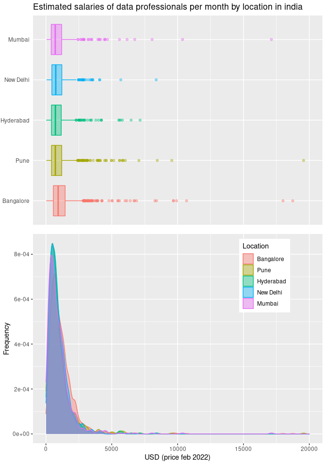<!-- -->

| Location  |  mean_usd |   dev_usd |
|:----------|----------:|----------:|
| Bangalore | 1318.5120 | 4305.3384 |
| Pune      | 1325.1763 | 5238.1048 |
| Hyderabad | 1319.0484 | 5587.4395 |
| New Delhi |  935.9838 |  732.8731 |
| Mumbai    | 1142.0104 | 3034.9252 |

According to this we can say that the location almost does not matter,
their distributions are very similar, New Delhi and Mumbai are the only
ones that lag behind in the mean.

# Currency

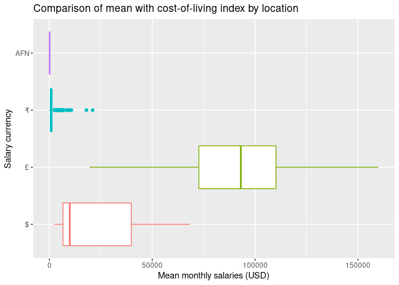<!-- -->

We can see that people who receive their salaries in another currency,
receive more than the rest, this may be due to the company they work
with. So, if it is important where the company is from and the currency
in which you are paid

# Job title

``` r
company_job <- df %>% group_by(Company.Name) %>% summarise(jobs=unique(Job.Title), .groups = "drop")
ggplot(company_job, aes(x=jobs)) + geom_bar() + 
  theme(axis.text.x = element_text(angle = 90, hjust = 1)) + coord_flip()
```

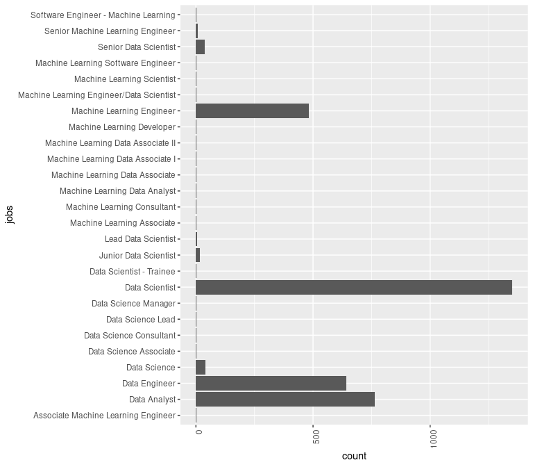<!-- -->

There are too many simulated professions but with different names, so
let’s classify them to better analyze them.

## Cleaning

### What is an associate ?

The word associate shows that the employee has a lower ranking position
than their colleagues who do not have the term in the same title. For
example, an associate manager has a little less seniority than a
manager. You will see the term associate used on job descriptions,
contracts of employment and other official documents. Q&A: What Is an
Associate? (2021, 9 junio). Indeed Career Guide.
<https://www.indeed.com/career-advice/finding-a-job/associate-position>

    ## # A tibble: 6 × 2
    ##   Company.Name  jobs                               
    ##   <chr>         <chr>                              
    ## 1 Amazon        Machine Learning Data Associate    
    ## 2 Amazon        Machine Learning Data Associate I  
    ## 3 Amazon        Machine Learning Associate         
    ## 4 Amazon        Machine Learning Data Associate II 
    ## 5 Techolution   Associate Machine Learning Engineer
    ## 6 ZS Associates Data Science Associate

We recognize which companies use this term and only 3 companies use this
term Amazon, Techolution, ZS Associates.

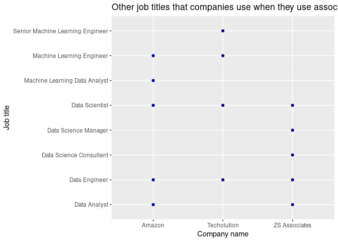<!-- -->

### Unification

First, let’s clarify that data scientist and data science are the same
thing, only the name is different. Also that the adjectives lead and
manager refer to leadership positions. However, we look for companies
that use certain terms that we hardly know.

And as we can see in some articles there are 3 main branches of jobs
that people in this field can take. (Johari, A. (2020, 25 noviembre).
Data Analyst vs Data Engineer vs Data Scientist: Skills,
Responsibilities, Salary. Edureka.
<https://www.edureka.co/blog/data-analyst-vs-data-engineer-vs-data-scientist/>)

But there are some job titles in which they touch on topics related to
one of the above, but they focus on something very specific such as
machine learning engineers which is part of data scientist according to
(Machine Learning Engineer vs. Data Scientist. (n. d.). Snowflake.
<https://www.snowflake.com/trending/machine-learning-engineer-vs-data-scientist>),
so we are going to create a new column called specialization.

Finally, job titles that are ancillary to other positions, such as
consultants, associates or developers will be classified as assistants.

| Job title                            | Unification name | Level   | Leadership position | Specialization   |
|--------------------------------------|------------------|---------|---------------------|------------------|
| Lead Data Scientist                  | Data Scientist   | NA      | TRUE                | NA               |
| Data Scientist                       | Data Scientist   | NA      | FALSE               | NA               |
| Data Science                         | Data Scientist   | NA      | FALSE               | NA               |
| Data Science Lead                    | Data Scientist   | NA      | TRUE                | NA               |
| Data Science Manager                 | Data Scientist   | NA      | TRUE                | NA               |
| Senior Data Scientist                | Data Scientist   | Senior  | FALSE               | NA               |
| Junior Data Scientist                | Data Scientist   | Junior  | FALSE               | NA               |
| Data Scientist - Trainee             | Data Scientist   | Trainee | FALSE               | NA               |
| Senior Machine Learning Engineer     | Data Scientist   | Senior  | FALSE               | Machine learning |
| Machine Learning Engineer            | Data Scientist   | NA      | FALSE               | Machine learning |
| Software Engineer - Machine Learning | Assistant        | NA      | FALSE               | Machine learning |
| Machine Learning Software Engineer   | Assistant        | NA      | FALSE               | Machine learning |
| Machine Learning Scientist           | Data Scientist   | NA      | FALSE               | Machine learning |
| Machine Learning Developer           | Assistant        | NA      | FALSE               | Machine learning |
| Machine Learning Data Analyst        | Data Analyst     | NA      | FALSE               | Machine learning |
| Data Analyst                         | Data Analyst     | NA      | FALSE               | NA               |
| Machine Learning Associate           | Assistant        | NA      | FALSE               | Machine learning |
| Machine Learning Data Associate      | Assistant        | NA      | FALSE               | Machine learning |
| Machine Learning Data Associate I    | Assistant        | NA      | FALSE               | Machine learning |
| Machine Learning Data Associate II   | Assistant        | NA      | FALSE               | Machine learning |
| Associate Machine Learning Engineer  | Assistant        | NA      | FALSE               | Machine learning |
| Data Science Associate               | Assistant        | NA      | FALSE               | Machine learning |

Therefore, we proceed as follows

``` r
dschar <- "Data Scientist"
df$especialization <- ifelse(grepl("Machine Learning", df$Job.Title), "Machine Learning", NA)
df$leadership_position <- ifelse(grepl("Lead|Manager", df$Job.Title), T, F)

df$job_title_unified <- ifelse(grepl(dschar, df$Job.Title), dschar, 
                        ifelse(grepl("Data Science|Machine Learning Engineer|Data Science|Machine Learning Scientist", df$Job.Title), dschar, 
                        ifelse(grepl("Data Analyst", df$Job.Title), "Data Analyst", 
                        ifelse(grepl("Developer|Software Engineer|Associate|Consultant", df$Job.Title), "Assistant", 
                        ifelse(grepl("Data Engineer", df$Job.Title), "Data Engineer",
                               NA)))))
df$job_title_unified <- factor(df$job_title_unified, levels = c("Assistant", "Data Engineer",  "Data Analyst",  "Data Scientist"))


df$level <- ifelse(grepl("Senior", df$Job.Title), "Senior", 
                   ifelse(grepl("Junior", df$Job.Title), "Junior", 
                          ifelse(grepl("Trainee", df$Job.Title),"Trainee", "Not classified")))
df$level <- factor(df$level, levels = c("Senior", "Junior", "Trainee", "Not classified"))
```

## Analysis

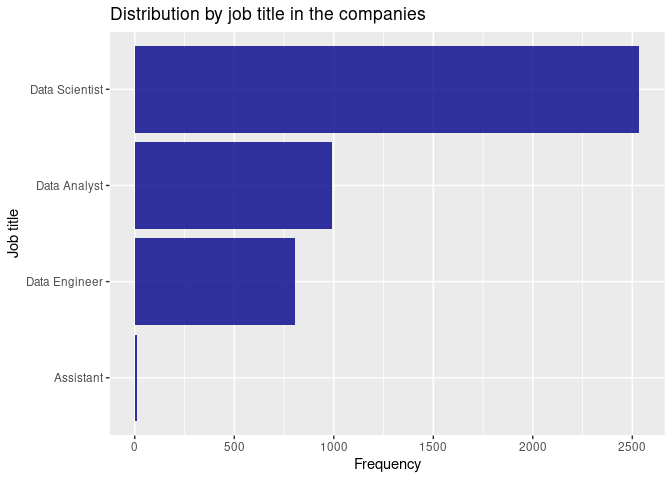<!-- -->

We have a very small sample of assistants job titles

``` r
total_workers <- sum(df$Salaries.Reported, na.rm=T)
gb_workers <- df %>% group_by(job_title_unified) %>% 
  summarise(total_workers=sum(Salaries.Reported, na.rm = T))
gb_workers$prob <- gb_workers$total_workers/total_workers
ggplot(gb_workers, aes(y=total_workers, x=job_title_unified, fill=job_title_unified)) + 
  geom_bar(stat="identity") + xlab("Job title") + ylab("Number of employees") +
  ggtitle("Number of employees by job title") + theme(legend.position = "none")
```

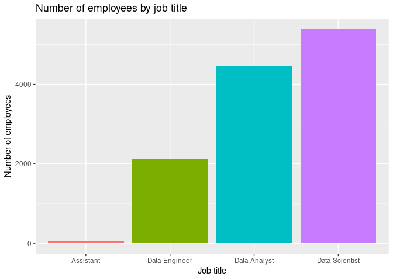<!-- -->

Considering that in the data there is a total of 12053.

# Level

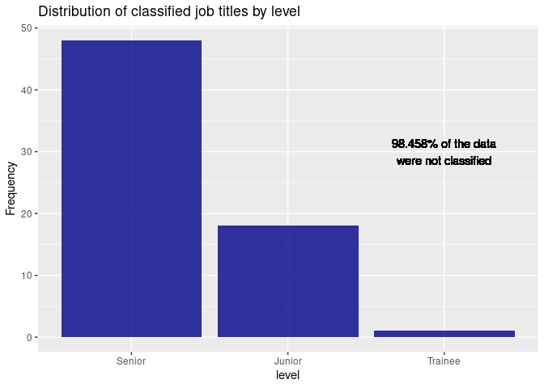<!-- -->

``` r
ggplot(subset(df, !level=="Not classified"), aes(x=estimated_monthly_salary_usd, y=job_title_unified, color=level)) + 
  geom_boxplot() + theme(legend.position = c(0.9, 0.8)) + xlab("Mean monthly salaries (USD)") + 
  ylab("Job title") + ggtitle("Level of experience by level compared to estimated salary") + 
  geom_text(x=3500, y="Data Scientist", label=paste(round(length(df$level[df$level == 'Not classified'])*100/length(df$level), 3), "% of the data\nwere not classified", sep=""), col="black")
```

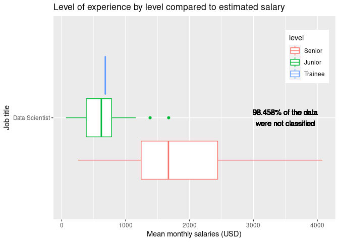<!-- -->

Since only 1.542 of the data was classified, it is complex to draw
conclusions from this. It is curious how the trainee position earns
slightly more than the average junior.

``` r
ggplot(df, aes(x=estimated_monthly_salary_usd, fill=job_title_unified)) + 
  geom_density(alpha=0.5, col="#00000000") + theme(legend.position = c(0.9, 0.8)) + 
  xlab("Dollars (USD)") + xlim(0, 7500) + ggtitle("Salary density per month by job title") +
  guides(fill=guide_legend(title="Job title")) + 
  geom_text(x=7000, y=0.0005, label=paste(length(df$estimated_monthly_salary_usd[df$estimated_monthly_salary_usd > 7500]), "atypical data ->"))
```

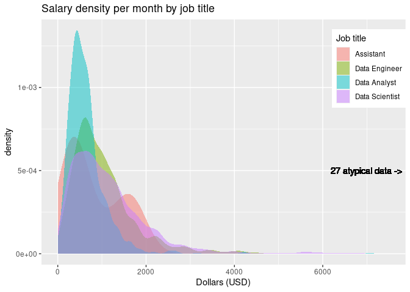<!-- -->

We observe that most salaries are concentrated below 2000 USD. We also
see that the salaries of analysts are highly concentrated below 1000
USD.

Assistants, which are those that include consultants, developers or
associates, generate a distribution with two raises.

``` r
ggplot(df, aes(x=estimated_monthly_salary_usd, y=salary_currency, color=job_title_unified)) + 
  geom_boxplot() + theme(legend.position = c(0.9, 0.8)) + xlab("Dollar (USD)") +
  ylab("Currency") + ggtitle("Estimated monthly salary by currency")
```

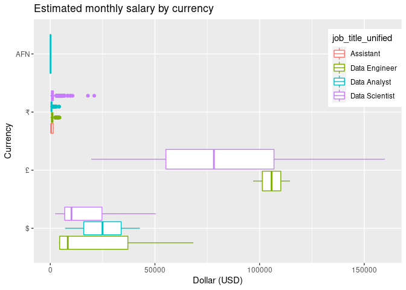<!-- -->

We see that salaries paid in Western currencies are higher than most of
those paid in the local currency, reaching very high points, and
establishing much higher averages. The euro even outperforms the U.S.
dollar. It is clear that the jobs paid in these currencies is because
they are foreign companies, which implies that within the country with a
weaker currency, the profits are supremely higher.

# Reference time for payment

We are looking for some relationship between the reference time for
payment and the estimated monthly salary.

``` r
ggplot(df, aes(x=estimated_monthly_salary_usd, y=payment_per, color=job_title_unified)) + 
  geom_boxplot() + theme(legend.position = c(0.9, 0.8)) + xlab("Dollar (USD)") +
  ylab("Reference time for payment") + ggtitle("Reference time for payment with estimated monthly salary")
```

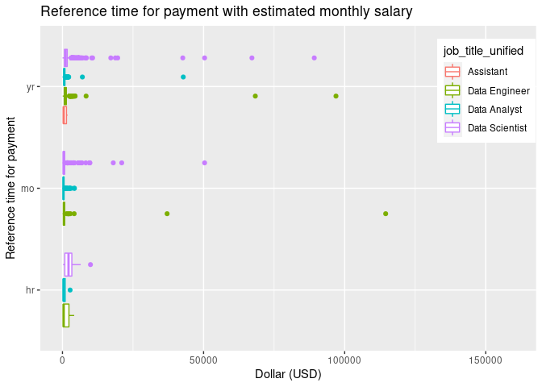<!-- -->

Because we have too much atypical data we zoom on the graph and limit it
in the estimated salary between 0 and 15000 USD.

``` r
ggplot(df, aes(x=estimated_monthly_salary_usd, y=payment_per, color=job_title_unified)) + 
  geom_boxplot() + theme(legend.position = c(0.9, 0.8)) + xlab("Dollar (USD)") +
  ylab("Reference time for payment") + ggtitle("Reference time for payment with estimated monthly salary") +
  xlim(0, 15000)
```

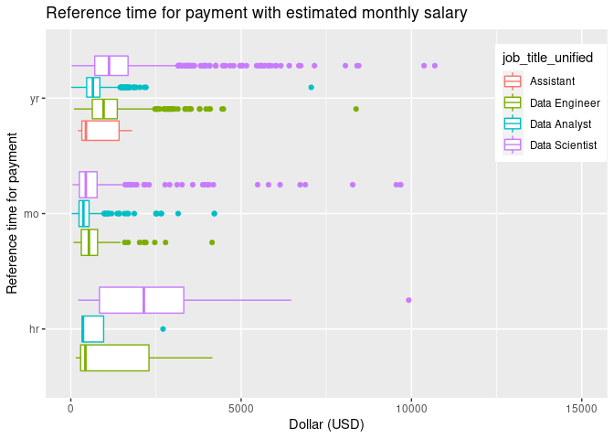<!-- -->

We observed that people who work hourly as data scientists, according to
the calculations we made, have on average higher monthly pay. It is also
notable that assistants have jobs with reference time for their salary
in years.

# Mean of salaries by unified job title

Since the data we obtain is the salary per role, we will now take into
account the number of jobs within the same company.

So now, we can say how much on average a person with the following
charges could earn

``` r
df$total_salaries_by_job_title <- df$Salaries.Reported*df$estimated_monthly_salary_usd
rank_by_job_title <- df %>% group_by(job_title_unified) %>% 
  summarise(mean=mean(total_salaries_by_job_title, na.rm=T), dev=sd(total_salaries_by_job_title, na.rm = T))

rank_by_job_title <- rank_by_job_title[order(-rank_by_job_title$mean),]
rank_by_job_title$rank <- 1:length(rank_by_job_title$mean)
knitr::kable(rank_by_job_title)
```

| job_title_unified |     mean |      dev | rank |
|:------------------|---------:|---------:|-----:|
| Data Engineer     | 2963.986 | 7119.724 |    1 |
| Data Analyst      | 2955.216 | 4502.292 |    2 |
| Data Scientist    | 2815.963 | 6822.958 |    3 |
| Assistant         | 2395.962 | 3170.067 |    4 |

# Company

## Ranking by company and job title

``` r
gb_company_job <- df %>% group_by(Company.Name, job_title_unified) %>% 
  summarise(mean_ts=mean(total_salaries_by_job_title, na.rm=T), .groups = "drop")
gb_company_job <- gb_company_job[order(-gb_company_job$mean_ts),]
gb_company_job$rank <- 1:length(gb_company_job$mean_ts)
knitr::kable(head(gb_company_job[,c("rank", "Company.Name", "job_title_unified", "mean_ts")], 25))
```

| rank | Company.Name                   | job_title_unified |  mean_ts |
|-----:|:-------------------------------|:------------------|---------:|
|    1 | Datametica                     | Data Engineer     | 51092.17 |
|    2 | MiQ                            | Data Scientist    | 48356.65 |
|    3 | Saama Technologies             | Data Scientist    | 46178.01 |
|    4 | Myntra                         | Data Analyst      | 46006.94 |
|    5 | ServiceNow                     | Data Engineer     | 37083.00 |
|    6 | Cognizant Technology Solutions | Data Engineer     | 33050.46 |
|    7 | Embibe                         | Data Scientist    | 31373.26 |
|    8 | Mu Sigma                       | Data Analyst      | 30682.55 |
|    9 | Coforge Senior                 | Data Engineer     | 28024.32 |
|   10 | Bharti Airtel                  | Data Scientist    | 23840.58 |
|   11 | Anheuser-Busch InBev           | Data Scientist    | 23613.46 |
|   12 | Walmart                        | Data Scientist    | 22935.27 |
|   13 | Fuzzy Logix                    | Data Scientist    | 22596.28 |
|   14 | L Brands                       | Data Scientist    | 21002.21 |
|   15 | Shell                          | Data Engineer     | 20658.54 |
|   16 | Innovaccer                     | Data Analyst      | 20303.06 |
|   17 | Société Générale               | Data Scientist    | 18915.74 |
|   18 | Target                         | Data Engineer     | 18738.16 |
|   19 | Flipkart                       | Data Scientist    | 18144.63 |
|   20 | Quantiphi Senior               | Data Engineer     | 18090.00 |
|   21 | Hashworks                      | Data Scientist    | 18002.97 |
|   22 | Amazon                         | Data Engineer     | 17628.57 |
|   23 | IBM                            | Data Scientist    | 17566.84 |
|   24 | EXL Service                    | Data Analyst      | 17021.03 |
|   25 | CRED                           | Data Scientist    | 16832.00 |

## Ranking by company

``` r
gb_company <- df %>%group_by(Company.Name) %>% 
  summarise(mean_ts=mean(total_salaries_by_job_title, na.rm=T), .groups = "drop")
gb_company <- gb_company[order(-gb_company$mean_ts),]

gb_company$rank <- 1:length(gb_company$mean_ts)
knitr::kable(head(gb_company[,c("rank", "Company.Name", "mean_ts")], 25))
```

| rank | Company.Name                   |  mean_ts |
|-----:|:-------------------------------|---------:|
|    1 | MiQ                            | 48356.65 |
|    2 | ServiceNow                     | 37083.00 |
|    3 | Coforge Senior                 | 28024.32 |
|    4 | Fuzzy Logix                    | 22596.28 |
|    5 | Myntra                         | 22310.19 |
|    6 | L Brands                       | 21002.21 |
|    7 | Saama Technologies             | 19780.53 |
|    8 | Bharti Airtel                  | 19638.83 |
|    9 | Embibe                         | 18422.56 |
|   10 | Anheuser-Busch InBev           | 17985.11 |
|   11 | Datametica                     | 17571.14 |
|   12 | CRED                           | 16832.00 |
|   13 | Fractal Senior                 | 16033.73 |
|   14 | Cognizant Technology Solutions | 14840.01 |
|   15 | Société Générale               | 13892.16 |
|   16 | FactSet                        | 13651.11 |
|   17 | Exadatum Big                   | 13351.63 |
|   18 | Mu Sigma                       | 13074.26 |
|   19 | LTI Senior                     | 13054.20 |
|   20 | dunnhumby                      | 12995.99 |
|   21 | Quantiphi                      | 12813.39 |
|   22 | Two Roads Tech                 | 12773.26 |
|   23 | Housing.com                    | 12213.17 |
|   24 | Antuit                         | 12119.03 |
|   25 | IBM                            | 12039.26 |

If you read this and from India I hope you are working on one of these
;3

Greetings. I am not a native English speaker, any corrections comment,
thanks.
